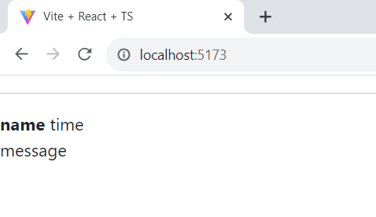

# React.js Exercise 4 – React Props

# Part 1 - ``ClickedButton`` Component with Props

1.	Modify the ``ClickedButton`` component to include props as shown in the slides/videos.  


# Part 2 - ``HelloWorld`` Component with Props

	
1.	Modify your `HelloWorld` component so you can pass a property `name='Bob'` like below:

	```javascript
	// src/App.tsx
    import HelloWorld from "./Components/HelloWorld";

    function App() {
    return <div><HelloWorld name='Bob' /></div>;
    }

    export default App;
	```

1.	The component should render "Hello Bob" if it works


<!-- ## Part 3 - ``Message`` Component

You will create a new ``Message`` component and render it.

1.	Create a new component file `Message.tsx` in the project `src/Components` folder.

1.	Add to `Message.tsx` the following code

	```javascript
	import React from 'react';

	class Message extends React.Component {
	    render() {
	      var d = new Date();
	      return (
	        <div>
	          <hr/>
	          <b>name</b> time
	          <p>message</p>
	        </div>
	      );
	    }
	}
	export default Message;
	```

1.	Next, open and modify ``src/index.tsx`` so that your the `<Message>` component is rendered:

	```javascript
	import React from 'react';
	import ReactDOM from 'react-dom';
	import Message from './Message.tsx';

	ReactDOM.render(<Message />, document.getElementById('root'));
	```

1.	Modify the Message component to accept properties for the name and message.  For example, the following code:

	```javascript
	import React from 'react';
	import ReactDOM from 'react-dom';
	import Message from './Message.tsx';

	ReactDOM.render(<Message name='Alice' message='Hello there Bob' />, document.getElementById('root'));
	```

	should render this:

	

1.	Next modify the Message component again to display the current time the message was posted:

	
	
	Use info [here](https:/www.w3schools.com/jsref/jsref_obj_date.asp) to guide you.


1.	Modify the code in `index.tsx` to see how multiple Message components may be added

	```javascript
	import React from 'react';
	import ReactDOM from 'react-dom';
	import Message from './Message.tsx';

	ReactDOM.render(
		<div>
			<Message name='Alice' message='Hello there Bob' />
			<Message name='Bob' message='How are you Alice?' />
		</div>, document.getElementById('root'));
	```

		You should see two messages now.


## Part 3 - MessageBoard Component

Let's get our messages from an array of JSON message objects this time.

1.	Add this code to your `Message.tsx` component

	```javascript
	const messages = [
			{name: "Alice", message: "Hello there Bob" },
			{name: "Bob", message: "How are you Alice?" },
			{name: "Alice", message: "Good Bob" }
	]

	class MessageBoard extends React.Component {
		render(){
	      return(
	        <div>
	          {
	            messages.map(function (message) {
	              return <Message name={message.name} message={message.message} />
	            })
	          }
	        </div>
	      )
	    }
	}
	export { MessageBoard };
	```

	Note the `messages` array and how the `map()` function is used to render Message components using this data.

1.	Next, modify the code in `index.tsx` to use the MessageBoard component:

	```javascript
	import React from 'react';
	import ReactDOM from 'react-dom';
	import { MessageBoard } from './Message.tsx';

	ReactDOM.render(<MessageBoard />, document.getElementById('root'));
	```

	You should see all the messages now. -->